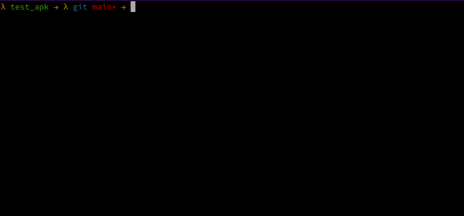

# 🫙 kavanoz 🫙


Statically unpacking common android banker malware.

Ever wanted to get payload from packed malware without running android emulator ? Me neither.



### Requirements
- python >= 3.9 
- arc4
- androguard
- lief
- unicorn
- androidemu
- pycryptodome


### :eyes: Installation

```
pip install -e . --user
```

### :zap: Usage

from cmdline
```bash
kavanoz /tmp/filepath
```

from python library
```py
from kavanoz.core import Kavanoz
k = Kavanoz(apk_path)
for plugin_result in k.get_plugin_results():
    if plugin_result['status'] = 'success':
        print('Unpacked')
        print(plugin_result)
```

### :snake: Scripts:

- [rc4.py](src/kavanoz/loader/rc4.py) Generic rc4 encrypted asset file. Script covers multiple versions.
- [old_rc4.py](src/kavanoz/loader/old_rc4.py) Another Generic rc4 encrypted asset file.
- [subapp.py](src/kavanozloader/subapp.py) Decryption of file with key derived from Manifest file ProtectKey variable
- [multidex.py](src/kavanoz/loader/multidex.py) Multidex like loader with inflated packed file. (zlib compression)
- [coper.py](src/kavanoz/loader/coper.py) Extract rc4 key from native lib with emulation (AndroidNativeEmu)
- [moqhao.py](src/kavanozloader/moqhao.py) Emulation for moqhau unpacking.
- [sesdex.py](src/kavanoz/loader/sesdex.py)
- [simple_aes.py](src/kavanoz/loader/simple_aes.py)
- [simple_xor.py](src/kavanoz/loader/simple_xor.py)
- [simple_xor2.py](src/kavanoz/loader/simple_xor2.py)
- [simple_xor_zlib.py](src/kavanoz/loader/simple_xor_zlib.py)
- [subapp.py](src/kavanoz/loader/subapp.py) Decrypt asset with package name

####  Note

Do not use cryptodome for rc4 decryption. It does not work with 2-4 key size.

### :gear: Development

To add new plugins just create new file in loader folder. Extend Unpacker class from unpack_plugin.py file. Define start_decrypt function with your implementation. 
```py
def start_decrypt(self, apk_object: APK, dvms: "list[DalvikVMFormat]"):
```

Add following function to make early exit from plugin. 
```py
def lazy_check(self,apk_object:APK, dvms: "list[DalvikVMFormat]"):
```

If extraction is succesful assign self.decrypted_payload_path with extracted file path.
You can use helper functions from unpacker class:
- get_array_data
- get_smali
- find_method(class_name,method_name,descriptor="")
- check_and_write_file(file_data) : checks file has dex, zip and zlib headers and writes unpacked dex with name : "external-{m[:8]}.dex"

### :book: Tips

- self.dvms hold dex dvm objects. You can get class with `dvm.get_class(smali_annotation_of_class)`.
- You can use get_smali function and give target method obj to get smali represantation of target method. Then apply some regex to get data from smali. There are lots of defined regexs in [smali_regexes.py](smali_regexes.py) file to lookup. 
- Most of the time packers use file from asset folder. You can get files with `self.apk_object.get_files()` 
- Most of the time packers use Application class to start unpacking sequence. Use `application = self.apk_object.get_attribute_value("application", "name")` to get application class defined in manifest file. 

### Thanks:
[apkdetect.com](https://apkdetect.com) for unique samples to work with. 

